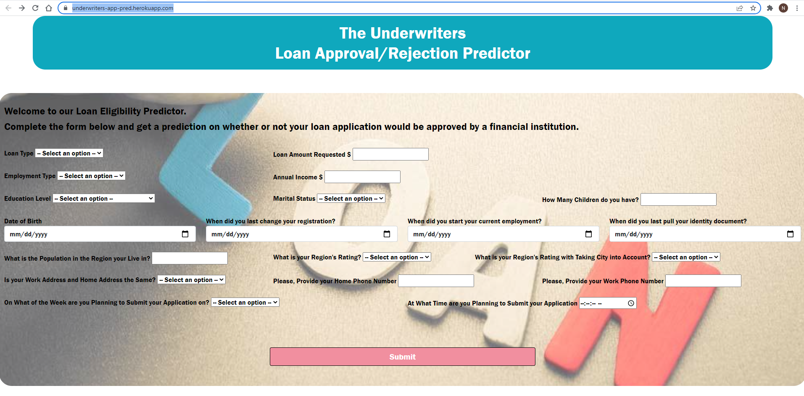

# underwriters-heroku-app
Deployment Repository of Loan Eligibility Predictor

This repository has been created and used for the deployment of a Loan Eligibility Application as part of the final team project of the GATECH Data Science and Analytics Bootcamp.

The team was comprised of:
- [Rajeswari Natchiappan.](https://github.com/RajeeNatch)
- [Shailesh Godkhindi.](https://github.com/sgodkhindi)
- [Corey Chickowski.](https://github.com/cchickowski)
- [Nazih Bouanani](https://github.com/NazihZaz)

A main repository that contains the entire Supervised Machine Learning Model and Flask App development. [Click here to be redirected to that repository](https://github.com/NazihZaz/Project_Underwriters).

# Application Development Steps:
1. Development of the [Supervised Machine Learning Model (including a scaler) and saving it as a pickle file](starter/Credit_Risk_Evaluator_Model.zipCredit_Risk_Evaluator_Model.zip).
2. Creation of a [Flask App](starter/app.py) which contains 2 routes:

a. Home route `("/")` that loads the home page. 

b. Prediction route `("/pred", methods=['POST'])` that collects the input of the online form, transform the array collected using the loaded scaler, runs the scaled array into the model loaded and returns the prediction. 

3. Creation of an [index.html](starter/templates/index.html) to `render_template` the [Flask App](starter/app.py).
4. Creation of a [style.css](starter/static/css/style.css) to style our webpage.
5. Creation of a [run.py](run.py) that fires up the [Flask App](starter/app.py).
6. Creation of a [requirements.txt](requirements.txt) that holds all the imports.
7. Creation of a [Procfile](Procfile).
8. Creation of an [__init__.py](starter/__init__.py).
9. Creation of an account and a new app on heroku.com.
10. Connecting the app to this GitHub Repository and deploying the app https://underwriters-app-pred.herokuapp.com/

Below is a screenshot of the deployed app:
